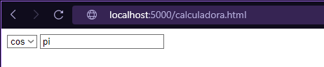
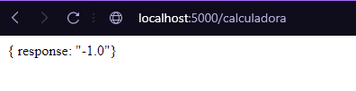
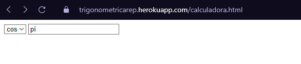
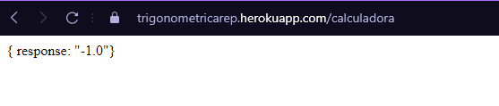

# TrigonometricOperationsSockets
Aplicación hecha con sockets la cual recibe una operación trigonométrica y un número y retorna su debida respuesta.
## Instrucciones de Uso
### Prerrequisitos
* git version 2.25.1
* Apache Maven versión: 4.0.0
* java versión: "1.8.0"
### Ejecución
Para poder usar el proyecto lo primero que se debe realizar es clonar el proyecto utilizando el siguiente comando desde una terminal:
```
git clone https://github.com/Desarik98/arep-parcial1.git
```
Luego debe redirigirse por medio de la terminal al directorio en donde se clonó el proyecto la cual contendrá el archivo pom.xml.
Una vez ubicado en este directorio se debe compilar el programa, para esto, utilice el siguiente comando:
```
mvn package
```
#### Funcionamiento

##### Local

Para observar su funcionamiento de manera local ejecute el siguiente comando:
```
java -cp java -cp TrigCalculator-1.0-SNAPSHOT.jar edu.escuelaing.arep.HttpServer.HttpServer
```

Diríjase a la siguiente url: http://localhost:5000/calculadora.html y podrá observar lo siguiente



En el seleccionador podrá escoger entre las siguientes operaciones trigonométricas:
- sin: seno
- cos: coseno
- tan: tangente

En el input podrá colocar el número que desee en radianes, para expresar el número PI tendrá que escribir "pi", para obtener la respuesta le dará a enter



Para observar su funcionamiento diríjase al siguiente link de heroku https://trigonometricarep.herokuapp.com/calculadora.html



En el seleccionador podrá escoger entre las siguientes operaciones trigonométricas:
- sin: seno
- cos: coseno
- tan: tangente

- En el input podrá colocar el número que desee en radianes, para expresar el número PI tendrá que escribir "pi", para obtener la respuesta le dará a enter
- 


## Autor
* Daniel Alejandro Mejía Rojas - Fecha: 09/09/2021
## Licencia
This project is licensed under the CC0 1.0 MIT License - see the LICENSE.md file for details
